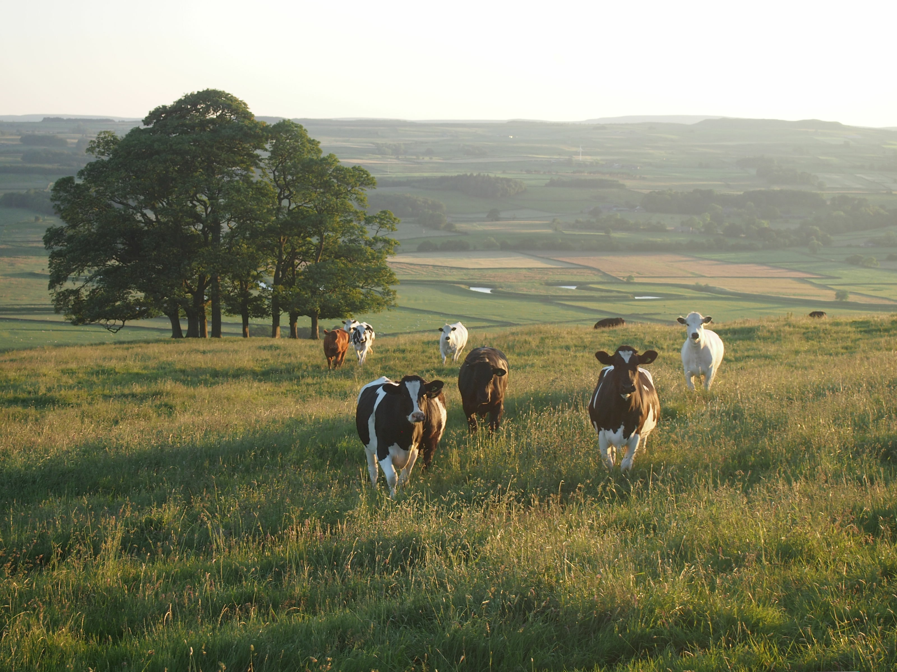

```{r setup, include=FALSE}
knitr::opts_chunk$set(echo = FALSE)
```

```{r}

```
<aside>
Photo by <a href="https://unsplash.com/@jakobcotton?utm_source=unsplash&utm_medium=referral&utm_content=creditCopyText">Jakob Cotton</a> on <a href="/s/photos/cows?utm_source=unsplash&utm_medium=referral&utm_content=creditCopyText">Unsplash</a>
</aside>

In this article I'll outline a snapshot of some of the work I've done at [UKCEH](https://www.ceh.ac.uk/). 

We're attempting to determine historic animal numbers in the UK, and spread them to historic land use.

This is to get a picture of historic inputs to soil, for example for Nitrogen through slurry and manure.

But another thing we're interested in is metal input to soil. But more on that later.

## Obtaining animals numbers

Animal numbers were downloaded from [Vision of Britain](https://www.visionofbritain.org.uk/data/dds_entity_page.jsp?ent=N_AGCEN_ANIMALS)

